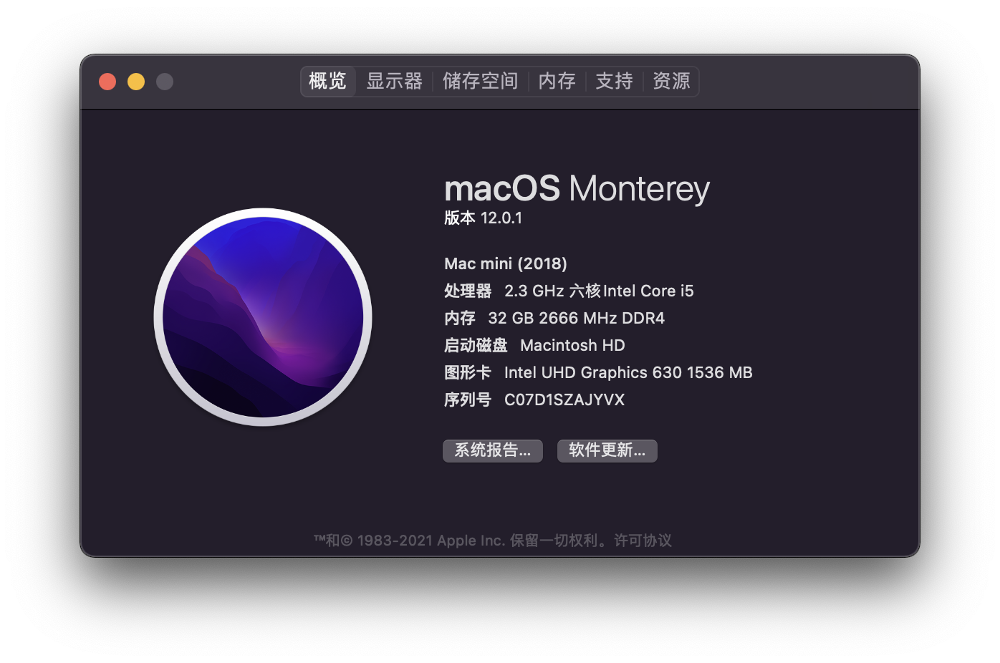
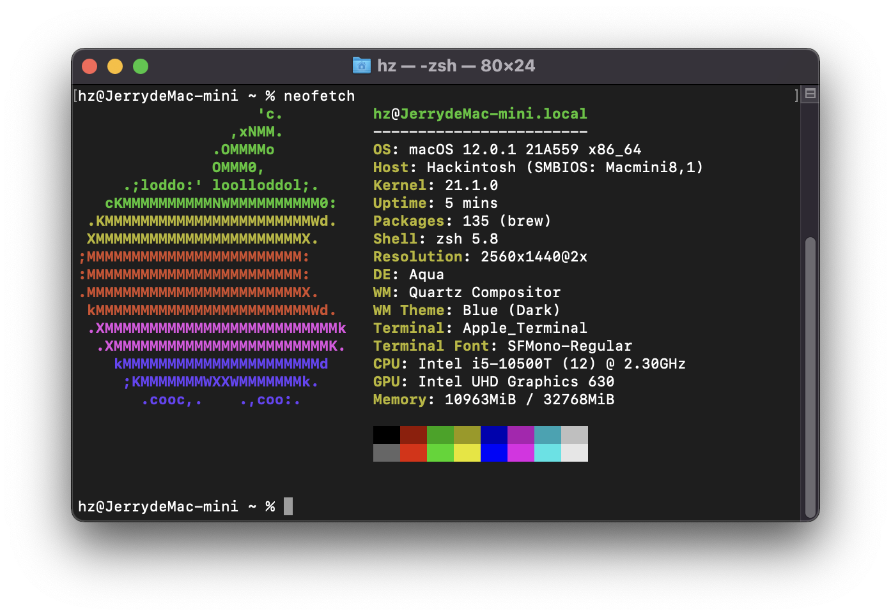
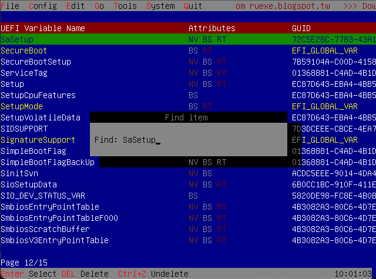
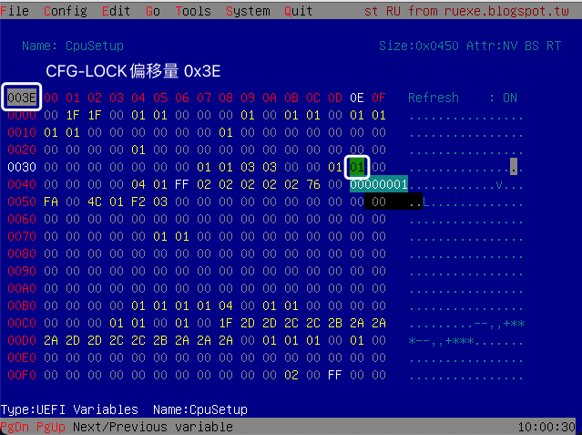
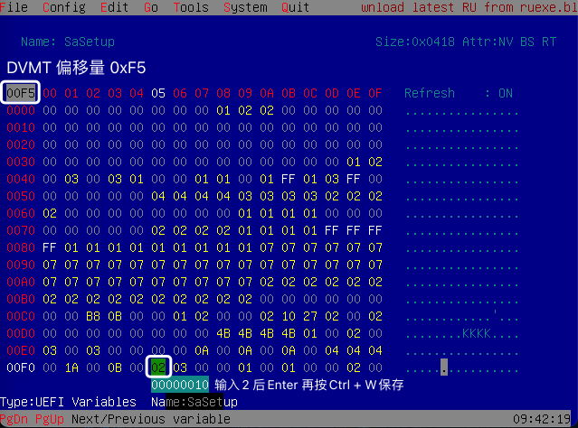

# OpenCore on Dell OptiPlex 7080 MFF

OpenCore for macOS Big Sur (11.3.1) on Dell OptiPlex 7080 MFF

## Tutorials

-   [折腾 7080MFF 黑苹果 OpenCore](https://www.jianshu.com/p/d7cfaae60509)
-   [3dudu/dell-optiplex-7080-hackintosh-opencore](https://github.com/3dudu/dell-optiplex-7080-hackintosh-opencore)
-   [likidu/opencore-7080-mff](https://github.com/likidu/opencore-7080-mff.git)
-   [Hackintosh-OptiPlex-7080-MT](https://github.com/btwise/Hackintosh-Dell-OptiPlex-7080-Series)
-   [Hackintosh-OptiPlex-7080-MT](https://github.com/webleon/Hackintosh-OptiPlex-7080-MT)
-   [OpenCore 简体中文参考手册](https://oc.skk.moe/)
-   [使用OpenCore引导黑苹果](https://blog.xjn819.com/post/opencore-guide.html)
-   [OpenCore黑苹果引导配置说明](https://shuiyunxc.gitee.io/2020/03/10/instru/index/)
-   [Optimizing Power Management](https://dortania.github.io/OpenCore-Post-Install/universal/pm.html)
-   [一条命令教你如何确认自己的机型及如何开启HWP](https://blog.daliansky.net/A-command-to-teach-you-how-to-confirm-their-own-models-and-how-to-open-the-HWP.html)
-   [国光的黑苹果安装教程：手把手教你配置 OpenCore](https://apple.sqlsec.com/)

## Hardware

-   CPU: Intel Comet Lake i5-10500T
-   Chipset: Intel Q470
-   Memory: 16G DDR4 2666 \* 2
-   iGPU: UHD 630
-   SSD: Lexar NM620 PCI-E M.2 1TB
-   Sound: ALC256/ALC3246
-   Ethernet: Intel I219-LM7
-   Wireless / BT: Replaced AX201 with [BCM94360CS2 M.2](https://dortania.github.io/Wireless-Buyers-Guide/types-of-wireless-card/m2.html)

## Status

### :white_check_mark: Working (with BCM94360CS2)

-   HWP
-   Sleep
-   iGPU with HiDPI
-   Ethernet
-   WiFi
-   Bluetooth
-   Sound
-   DP/HDMI Audio

### :x: Not Working (with BCM94360CS2)

-   DRM (Only dGPU could fix this)

## BIOS

|Settings|Value|
|----|---|
|System Configuration → Integrated NIC | Enabled |
|System Configuration → SATA Operation | AHCI |
|Security → PTT Security/PTT On | Disabled |
|Secure Boot → Secure Boot Enable | Disabled |
|Secure Boot → Secure Boot Mode | Audit Mode |
|Intel SGE → SGX | Disabled |
|Performance → Intel SpeedStep | Enabled |
|Performance → C-States Control | Enabled |
|Performance → Turboost | Enabled |
|Performance → HyperThread Control | Enabled |
|Power Management → Intel Speed Shift Technology | Enabled |
|Power Management → Deep Sleep Control | Disabled |
|Power Management → USB Wake Support | Disabled |
|Power Management → Wake on LAN/WLAN | Lan only |
|Power Management → Block Sleep | Disabled |
|POST Behavior → Fastboot | Minimal |
|Virtualization Support → Virtualization | Enabled |
|Virtualization Support → VT For Direct I/O | Disabled |
|Advanced configurations → ASPM | Auto |

## Gotchas

-   Use [RU.efi](http://ruexe.blogspot.com/) modify BIOS to disable CFG Lock(0x3E=0x00) and enable DVMT(0xF5=0x02). Use `Ctrl+W` to save the change. And the DVMT is within the **SaSetup**, which is different from CFG Lock which locates within **CpuSetup**.
-   Mostly followed [折腾 7080MFF 黑苹果 OpenCore](https://www.jianshu.com/p/d7cfaae60509) to prepare the EFI for both installation and daily running environment.
-   The `SSDT-RHUB.aml` needs to be removed if you manually mapped your USB ports with [Hackintool](https://github.com/headkaze/Hackintool) by using the `USBPorts.kext`.
-   The `AirportItlwm.kext` will cause kernel panic now.

### Upgrading

-   You might encounter `IPI Time` kernel panic during upgrading to newer version of macOS. I suspect it was still due to the sleeping tweak is not fully working. The mitigation right now is use the USB stick to boot up with the Installation EFI successfully. Then remove the USB stick and reboot again normally into the system.

-   FakePCIID can cause kernel panic when upgrade to Monterey, these kernel module must delete or disable before upgrade to Monterey!!!

## 修改DVMT和CFG LOCK
* 无法使用Grub Setup_var 需要用到Ru.efi 将Ru.efi在BIOS中添加进Boot Menus 后启动 进入Ru后按 "Alt" + "=" 并
查找 **CPUSetup** 和 **SaSetup**

* 解锁"CFG-LOCK" 找到CPUSetup 将横排 "0030" "0E" 位改为 00 按 Ctrl + W 保存

* 修改DVMT 搜索 SaSetup 将横排 "00F0" "05" 位改为 "02" 按 Ctrl + W 保存

## Updates

-   **2021/5/17**: First install with OpenCore 0.6.5
-   **2021/5/18**: Fix DP/HDMI Audio issue follow [This Post](https://www.insanelymac.com/forum/topic/345756-no-hdmi-dp-audio-devices-on-uhd-630/)
-   **2021/5/19**: Upgrade to OpenCore  0.6.9 and change boot screen to GUI mode
-   **2021/6/28**: Upgrade to OpenCore  0.7.0
-   **2021/7/28**: Upgrade to OpenCore  0.7.1 and fix HEVC hardware acceleration issue
-   **2021/9/22**: Upgrade to OpenCore  0.7.3 and upgrade to MacOS 11.6
-   **2021/10/28**: Upgrade to OpenCore  0.7.4 and upgrade to MacOS Monterey(12.0.1) !
-   **2021/12/7**: Upgrade to OpenCore  0.7.6 and upgrade to MacOS Monterey(12.1)
-   **2022/4/4**: Upgrade to OpenCore  0.7.9 and upgrade to MacOS Monterey(12.3.1)
-   **2022/8/9**: Upgrade to OpenCore  0.8.2 and upgrade to MacOS Monterey(12.5)
