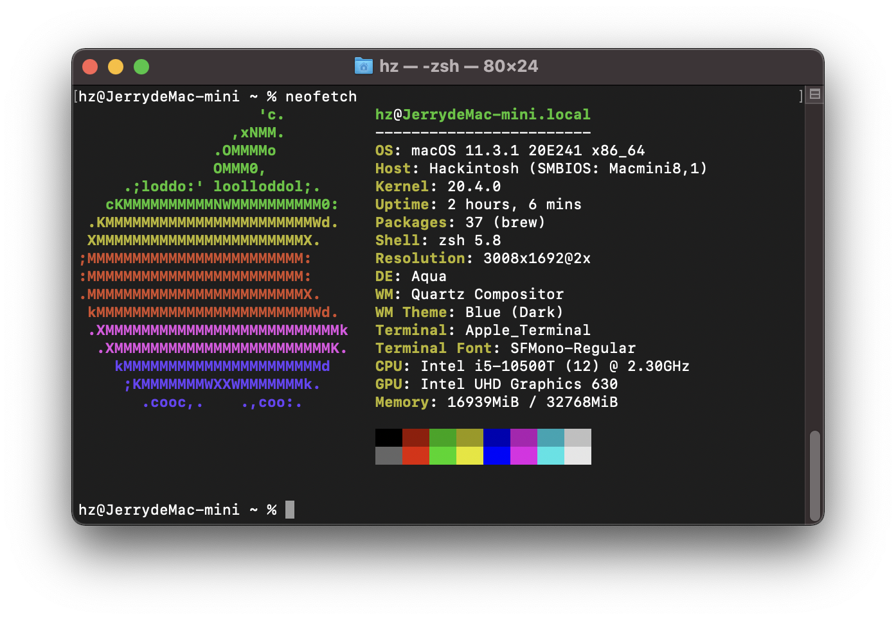

# OpenCore on Dell OptiPlex 7080 MFF

OpenCore for macOS Big Sur (11.3.1) on Dell OptiPlex 7080 MFF

## Tutorials

-   [折腾 7080MFF 黑苹果 OpenCore](https://www.jianshu.com/p/d7cfaae60509)
-   [3dudu/dell-optiplex-7080-hackintosh-opencore](https://github.com/3dudu/dell-optiplex-7080-hackintosh-opencore)
-   [likidu/opencore-7080-mff](https://github.com/likidu/opencore-7080-mff.git)

## Hardware

-   CPU: Intel Comet Lake i5-10500T
-   Chipset: Intel Q470
-   Memory: 16G DDR4 2666 \* 2
-   iGPU: UHD 630
-   SSD: Lexar NM620 PCI-E M.2 1TB
-   Sound: ALC256/ALC3246
-   Ethernet: Intel I219-LM7
-   Wireless / BT: Replaced AX201 with [BCM94360CS2 M.2](https://dortania.github.io/Wireless-Buyers-Guide/types-of-wireless-card/m2.html)

## Status

### :white_check_mark: Working (with BCM94360CS2)

-   HWP
-   Sleep
-   iGPU with HiDPI
-   Ethernet
-   WiFi
-   Bluetooth
-   Sound
-   DP/HDMI Audio

### :x: Not Working (with BCM94360CS2)

-   None

## BIOS

|Settings|Value|
|----|---|
|System Configuration -> Integrated NIC | Enabled |
|System Configuration -> SATA Operation | AHCI |
|Security -> PTT Security/PTT On | Disabled |
|Secure Boot -> Secure Boot Enable | Disabled |
|Secure Boot -> Secure Boot Mode | Audit Mode |
|Intel SGE -> SGX | Disabled |
|Performance -> Intel SpeedStep | Enabled |
|Performance -> C-States Control | Enabled |
|Performance -> Turboost | Enabled |
|Performance -> HyperThread Control | Enabled |
|Power Management -> Intel Speed Shift Technology | Enabled |
|Power Management -> Deep Sleep Control | Disabled |
|Power Management -> USB Wake Support | Disabled |
|Power Management -> Wake on LAN/WLAN | Lan only |
|Power Management -> Block Sleep | Disabled |
|POST Behavior -> Fastboot | Minimal |
|Virtualization Support -> Virtualization | Enabled |
|Virtualization Support -> VT For Direct I/O | Disabled |
|Advanced configurations -> ASPM | Auto |

## Gotchas

-   Use RU.efi modify BIOS to disable CFG Lock(0x3E=0x00) and enable DVMT(0xF5=0x02). Use `Ctrl+W` to save the change. And the DVMT is within the **SaSetup**, which is different from CFG Lock which locates within **CpuSetup**.
-   Mostly followed [折腾 7080MFF 黑苹果 OpenCore](https://www.jianshu.com/p/d7cfaae60509) to prepare the EFI for both installation and daily running environment.
-   The `SSDT-RHUB.aml` needs to be removed if you manually mapped your USB ports with [Hackintool](https://github.com/headkaze/Hackintool) by using the `USBPorts.kext`.
-   The `AirportItlwm.kext` will cause kernel panic now.

### Upgrading

-   You might encounter `IPI Time` kernel panic during upgrading to newer version of macOS. I suspect it was still due to the sleeping tweak is not fully working. The mitigation right now is use the USB stick to boot up with the Installation EFI successfully. Then remove the USB stick and reboot again normally into the system.

## Updates

-   **2021/5/17**: First install with OpenCore 0.6.5
-   **2021/5/18**: Fix DP/HDMI Audio issue follow [This Post](https://www.insanelymac.com/forum/topic/345756-no-hdmi-dp-audio-devices-on-uhd-630/)
-   **2021/5/19**: Upgrade to OpenCore  0.6.9 and change boot screen to GUI mode
